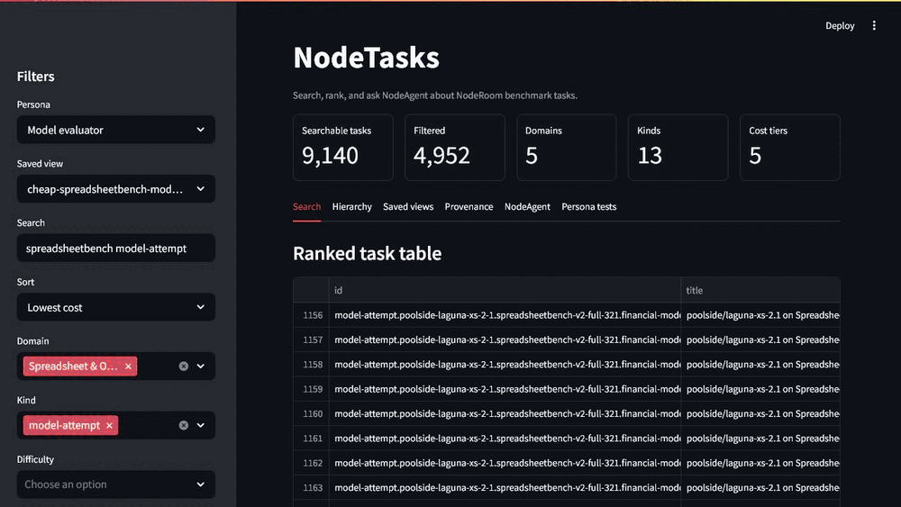

# NodeTasks

NodeTasks is a public task corpus and benchmark-proxy adapter bundle extracted from NodeRoom. It is meant to make live browser tasks, benchmark proxy adapters, proof receipts, rubrics, benchmark-suite scaffolds, and source-backed test tasks discoverable outside the main application repo.

Storyboard first: the README clip is governed by [`docs/FEATURE_PROOF_STORYBOARD.md`](docs/FEATURE_PROOF_STORYBOARD.md). It must prove ranked search, saved bundles, provenance, and NodeAgent catalog Q&A before it is treated as a publishable proof asset.



This repo is a curated source snapshot, not a claim of official benchmark scores. External benchmark adapters separate:

- `productPathCompletion`: whether a product UI path ran with visible proof artifacts.
- `officialSemanticScore`: an official benchmark score only when an upstream verifier is available and explicitly recorded.

## What Is Included

- Benchmark proxy adapters from `proofloop/benchmarks`.
- Local proxy tasks for Finch, FinAuditing, WorkstreamBench, and BankerToolBench.
- ProofLoop accounting, Notion, Proximitty, SEC/XBRL, live browser, and rubric files.
- Noderl proof/eval packages and anti-reward-hacking doctrine.
- NodeRoom benchmark/eval scripts and tests relevant to live tasks, proxy adapters, proof loops, and benchmark gates.
- Source support referenced by those suites, including `src/`, `convex/`, and NodeAgent adoption examples.
- Generated catalogs and a searchable task browser under `catalog/`.

## What Is Not Included

- Secrets, env files, generated `.proofloop` run state, local memory stores, `node_modules`, logs, or transient browser output.
- Official upstream benchmark datasets unless they were already represented as small synthetic/local fixtures in the source snapshot.
- Any claim that a proxy adapter result is an official leaderboard score.

## Layout

```text
catalog/
  all-tasks.json
  benchmark-proxy-adapters.json
  extracted-tasks.json
  live-interaction-tasks.json
  provenance-index.json
  ranked-tasks.json
  saved-views.json
  search-index.jsonl
  search-index.js
  task-browser.html
  task-bundles.json
  source-files.json
  task-index.json
  task-families.md
assets/
  nodetasks-streamlit-explorer.gif
schemas/
  node-task.schema.json
scripts/
  build-catalog.mjs
  validate-catalog.mjs
upstream/noderoom/
  convex/
  examples/
  proofloop/
  noderl/
  src/
  scripts/
  tests/
  docs/
```

## Runnability Note

This repository preserves the benchmark/task corpus and the source support those files reference. Live production tasks still require an actual NodeRoom deployment, provider credentials, and any upstream benchmark datasets or official scorers that are intentionally not vendored here.

## Search The Tasks

The generated corpus currently exposes `9,155` searchable tasks:

- `58` curated live interaction tasks.
- `1,354` benchmark target tasks from the prod proxy matrix.
- `5,416` model-attempt tasks derived from matrix models x task targets.
- `1,030` extracted unit/browser test cases.
- QA features, scenarios, rubrics, suites, adapters, local proxy tasks, and source-reference records.
- Rank metadata for domain, subdomain, estimated steps, cost tier, difficulty tier, persona fit, and top tags.
- Per-task curation fields: summary, why it matters, first run, caution, recommended personas, and score-boundary language.
- Per-task provenance fields: suite lineage, verifier type, score status, receipt expectations, and source kinds.
- `9` saved views and `9` shareable task bundles for common user roles.

Use the CLI:

```bash
npm run search -- graph nodeagent --limit 5
npm run search -- spreadsheetbench --kind model-attempt --limit 10
npm run search -- trace notebook --limit 10
npm run search -- --family spreadsheetbench-v1-full-912 --kind benchmark-target --limit 10
npm run search -- graph --domain "Collaboration & Room UX" --sort difficulty
npm run search -- --view cheap-spreadsheetbench-models --limit 5
npm run search -- --view browser-proof-surfaces --limit 5
```

Or open the local browser search UI:

```text
catalog/task-browser.html
```

The browser UI is static and uses `catalog/search-index.js`; no backend is required.

## Streamlit Explorer

Run the interactive explorer:

```bash
pip install -r requirements.txt
npm run streamlit
```

The Streamlit app supports:

- Search and sort by relevance, domain hierarchy, difficulty, steps, and cost.
- Filters for domain, task kind, difficulty tier, cost tier, and tags.
- Saved views and downloadable task bundles for onboarding, model evals, browser proof, finance/evidence work, governance gates, NodeAgent runtime, public Node repo proofs, and collaboration interiors.
- Provenance rollups by verifier type, source kind, primary suite, and score-boundary status.
- Persona lenses for benchmark maintainers, model evaluators, product QA, finance analysts, and new contributors.
- A NodeAgent chat panel. Set `NODEAGENT_ENDPOINT` to a POST endpoint that follows `docs/NODEAGENT_BRIDGE.md`, or leave it empty to use deterministic local catalog-agent mode with cited task ids.

Persona smoke results are tracked in `docs/PERSONA_SMOKE_RESULTS.md`.

Useful local URLs:

```text
http://127.0.0.1:8502/?view=cheap-spreadsheetbench-models&persona=Model%20evaluator
http://127.0.0.1:8502/?view=browser-proof-surfaces&persona=Product%20QA
http://127.0.0.1:8502/?view=proofloop-governance-gates&persona=Benchmark%20maintainer
```

## Refresh The Catalog

```bash
npm run build:catalog
npm run search -- nodeagent graph --limit 5
npm run validate
python -m py_compile apps\nodetasks_streamlit.py
npm run clip:capture
```

## Task Philosophy

NodeTasks follows the same split as NodeRoom ProofLoop:

- Certification loop: locked product UI path, immutable verifier expectations, proof receipt.
- Exploration loop: new scenarios, task proposals, adversarial cases, and adapter research.

A task should be scored from deterministic UI/proof artifacts, not chat transcripts or screenshots alone.

## Safety

The Proximitty and underwriting fixtures are synthetic evaluation data. They must not be used for real financial, legal, lending, insurance, or investment decisions.
