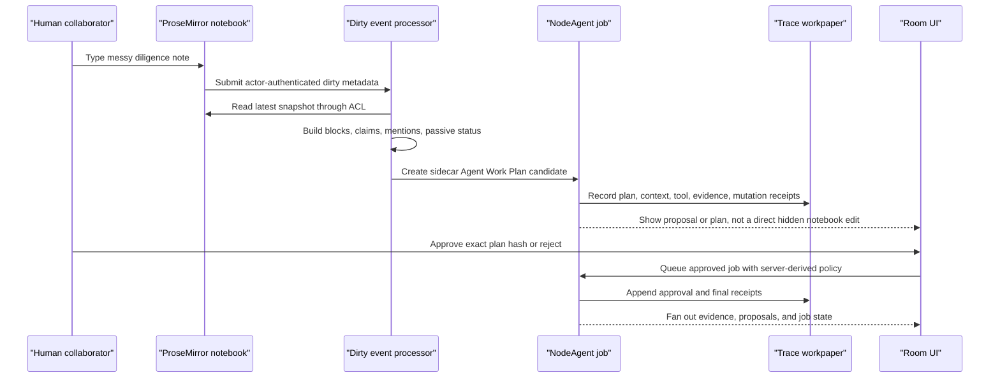

# Trace User QA Cases

Updated: 2026-06-21

This matrix answers a narrower question than `LIVE_USER_QA_CASES.md`: does the
live browser QA prove the Trace and staff-engineer claims from the design notes?

Short answer: no, not all of them. Live user browser QA proves the collaboration
surface and selected Trace Lens behavior. The broader Trace ambition also needs
runtime, backend, eval, and provenance checks. This file keeps those proof levels
separate so release claims stay honest.

## Status Legend

| Status | Meaning |
|---|---|
| Live-browser proven | A Playwright browser test drives the product UI and asserts the behavior. |
| Runtime proven | A deterministic Vitest or Convex test proves the contract without a browser. |
| Documented standard | The architecture or product rule is written down, but not enforced end to end. |
| Gap | The claim is still target architecture or partial implementation. |

## Canonical Flow Under Proof

The staff-engineer target flow is one user-visible loop: a messy note becomes a
reviewable, source-backed agent work plan without letting the agent silently edit
the human's notebook text.



## Runbook

Use this focused suite when validating Trace and notebook-sidecar claims:

```bash
npm test -- --run tests/nodeagentTraceSpine.test.ts tests/traceData.test.ts tests/agentJobsRuntime.test.ts tests/notebookProcessingTarget.test.ts tests/nativeNotebookProsemirror.test.ts tests/evalTrustPolicy.test.ts
npx playwright test e2e/trace-tab.spec.ts --workers=1
```

Use the full live collaboration gate from `LIVE_USER_QA_CASES.md` when validating
multi-browser coediting, privacy, wall, job, and proposal claims:

```bash
npm run test:product:memory
npm run test:product:live:agent
```

## Latest Local Verification

Run date: 2026-06-21

| Layer | Command | Result | Notes |
|---|---|---:|---|
| Trace browser UI | `npx playwright test e2e/trace-tab.spec.ts --workers=1` | 6/6 passed | Validates Trace tab records, screenshots, source-cell open, grouped steps, boxed web source, tool steps, non-shippable verdicts, and graph detail. The clean run used a manually managed local Vite server on port 4197 after the default Playwright-owned server teardown path hung once after all six tests had reported `ok`. |
| Trace and notebook runtime | `npm test -- --run tests/nodeagentTraceSpine.test.ts tests/traceData.test.ts tests/agentJobsRuntime.test.ts tests/notebookProcessingTarget.test.ts tests/nativeNotebookProsemirror.test.ts tests/evalTrustPolicy.test.ts` | 35/35 passed | Validates Trace schema/receipts/redaction, Trace UI data, job policy/receipts, ProseMirror dirty processing, and eval trust policy. |
| Broad live collaboration | `npm run test:product:memory`, `npm run test:product:live`, and `npm run test:product:live:agent` | See `LIVE_USER_QA_CASES.md` | Release-floor browser suite passed 31/31; live Convex browser suite passed 6/6 on 2026-06-21; live Convex strict agent browser suite passed 6/6 on 2026-06-21. |

## Trace Proof Matrix

| ID | Claim from notes | Current status | Proof | Gap before stronger claim |
|---|---|---|---|---|
| TQ-01 | Trace is the workpaper linking trigger, plan, context pack, steps, evidence, mutations, approvals, eval, and final output. | Runtime proven for the schema and builder; not universal persistence. | `src/nodeagent/traces/traceTypes.ts`, `tests/nodeagentTraceSpine.test.ts`, `docs/traces/TRACE_SYSTEM.md` | One canonical live room run should expose the same `traceId` through job, evidence, proposal, approval, eval, and replay proof. |
| TQ-02 | Tool calls become redacted, replayable receipts. | Runtime proven. | `src/nodeagent/traces/traceReceipts.ts`, `tests/nodeagentTraceSpine.test.ts`, `tests/agentJobsRuntime.test.ts` | Coverage should expand from representative tools to every serious RoomTools write/read tool. |
| TQ-03 | Context packs include and exclude sources with reasons. | Runtime proven for frame context conversion. | `src/nodeagent/traces/traceContextPack.ts`, `tests/nodeagentTraceSpine.test.ts` | Browser UI should show the bounded context audit for authorized reviewers. |
| TQ-04 | Agent mutations leave receipts and stale CAS cannot overwrite. | Runtime proven and live-browser covered for spreadsheet conflicts. | `tests/agentJobsRuntime.test.ts`, `e2e/reactivity.backend.spec.ts`, `e2e/three-user-collab.spec.ts` | Patch-bundle final CAS needs the same visible receipt path across notebook blocks and slide/deck structures. |
| TQ-05 | Approval is part of the workpaper. | Runtime proven for Agent Work Plan approval and live-browser proven for spreadsheet proposals. | `tests/notebookProcessingTarget.test.ts`, `e2e/three-user-collab.spec.ts`, `e2e/live-broad-convex.spec.ts` | Trace record should show the approval receipt beside the exact affected object in the live room UI. |
| TQ-06 | Trace Lens shows steps, screenshots, boxed sources, tool calls, verdicts, and graph navigation. | Live-browser proven in the demo Trace tab. | `e2e/trace-tab.spec.ts`, `src/ui/panels/TraceSurface.tsx`, `src/ui/panels/TraceFlow.tsx`, `src/ui/panels/TraceStepRow.tsx` | The browser fixture is seeded/demo data; it should also be driven by the live job/proposal/eval trace from TQ-01. |
| TQ-07 | Eval scores only count when bound to trace proof. | Documented standard plus partial runtime trust policy. | `docs/traces/TRACE_EVAL_BINDING.md`, `tests/evalTrustPolicy.test.ts` | Every eval row should carry a durable `traceId`, proof refs, and trace excellence level before it can block a merge. |
| TQ-08 | Rework ledger captures failed approaches and why the replacement won. | Documented standard. | `docs/traces/TRACE_REWORK_LEDGER.md`, README "Collaboration Architecture Evolution" | No CI gate yet requires a rework entry when replacing sync, job, memory, or eval behavior. |
| TQ-09 | Durable memory should not exist without trace provenance. | Documented standard and partial architecture. | `docs/traces/TRACE_SYSTEM.md`, `docs/traces/TRACE_EVAL_BINDING.md` | A first-class memory read model with enforced `traceId` is still not universally shipped. |
| TQ-10 | Public Trace state is redacted and private payloads stay behind Builder access. | Runtime proven for redaction; documented for UI boundary. | `tests/nodeagentTraceSpine.test.ts`, `docs/traces/TRACE_UI_STANDARD.md` | Add browser tests for private trace visibility and Builder-only detail access. |

## Staff Workflow Proof Matrix

| ID | Claim from notes | Current status | Proof | Gap before stronger claim |
|---|---|---|---|---|
| SW-01 | ProseMirror owns live notebook text; dirty metadata owns processing triggers. | Live-browser proven for the native notebook path; legacy Tiptap remains fallback only when the feature flag is off. | `e2e/notebook-workplan-live.spec.ts`, `tests/nativeNotebookProsemirror.test.ts`, `tests/notebookProcessingTarget.test.ts`, README "Collaboration Architecture Evolution" | Extend from document-level dirty metadata to per-block affected-set presence and patch-bundle proof. |
| SW-02 | Dirty events are actor-authenticated, deduped, quiet-windowed, and ACL-gated. | Runtime proven and browser-visible for the processed read-model state. | `tests/notebookProcessingTarget.test.ts`, `e2e/notebook-workplan-live.spec.ts` | Add browser privacy/revocation coverage for private notebook dirty events. |
| SW-03 | Passive intelligence writes read-model sidecars, not hidden notebook text edits. | Live-browser proven for read-model sidecar and work-plan review beside the notebook. | `tests/notebookProcessingTarget.test.ts`, `e2e/notebook-workplan-live.spec.ts` | Extend approved jobs to produce evidence/proposal output after the queued job. |
| SW-04 | Agent Work Plan approval uses canonical plan hash before queuing a job. | Live-browser proven. | `tests/notebookProcessingTarget.test.ts`, `e2e/notebook-workplan-live.spec.ts` | Add planned-vs-actual receipt comparison after job execution, not only queued admission. |
| SW-05 | Server derives public job policy instead of trusting client-sent model/approval/evidence fields. | Runtime proven. | `tests/agentJobsRuntime.test.ts` | Browser job detail should expose the server-resolved policy in every route picker path. |
| SW-06 | Spreadsheet collaboration supports advisory presence, human/agent intent, CAS, and CRS proposals. | Live-browser proven for the shipped spreadsheet slice. | `docs/qa/LIVE_USER_QA_CASES.md`, `e2e/realtime-presence.spec.ts`, `e2e/semantic-rebase.backend.spec.ts`, `e2e/three-user-collab.spec.ts` | Do not call this full Google Sheets or Figma parity; it is collaboration primitive parity for the room contract. |
| SW-07 | Agent feels real-time beside the human without inaccessible loading or blocked work areas. | Live-browser proven for spreadsheet advisory presence and notebook read-model/work-plan sidecar. | `e2e/realtime-presence.spec.ts`, `e2e/notebook-workplan-live.spec.ts`, `e2e/three-user-collab.spec.ts`, `docs/qa/LIVE_USER_QA_CASES.md` | More UX assertions should cover deck/slide objects and richer proposal review states. |
| SW-08 | PowerPoint/deck source of truth is `deck-plan` JSON, with HTML/PPTX/PDF derived. | Documented target architecture only. | README "Collaboration Architecture Evolution" | Needs deck-plan schema, server intent policy derivation, slide/block presence, affected-set planning, and export proof. |
| SW-09 | Spreadsheet index work is incremental and backgrounded. | Partially shipped for coalesced refresh direction; not full proof. | README "Collaboration Architecture Evolution" | Need dedicated tests for incremental/background index updates under rapid edits. |
| SW-10 | Browser QA proves privacy, jobs, wall, and proposals broadly. | Live-browser proven for the listed cases. | `docs/qa/LIVE_USER_QA_CASES.md`, `e2e/privacy-job-wall-proposal.spec.ts`, `e2e/live-broad-convex.spec.ts` | Inventory gaps remain for reload persistence, job resume after reload, Accept all, richer failure injection, and multi-user wall collisions. |

## Claim Boundary

What can be claimed now:

- Broad live Convex browser coverage exists for the shipped spreadsheet room
  contract: public/private lanes, advisory presence, CAS convergence, CRS
  proposals, host review, wall CRUD, and job controls.
- Trace has a real schema, redaction, receipt adapters, UI records, Trace Lens
  browser coverage, and runtime tests.
- Native notebook ProseMirror dirty-event processing is backend-proven, including
  actor checks, dedupe, privacy, visibility pullback, read-model sidecars, and
  Agent Work Plan plan-hash approval. The live browser now proves the default
  native-notebook path from messy note to read-model sidecar, affected-source
  work-plan card, approved queued job, and room-trace receipt.

What should not be claimed yet:

- Full Google Sheets or Figma product parity.
- Full Trace L8 workpaper coverage for every durable memory, eval row, browser
  proof, approval, and mutation in one live run.
- Full notebook block-level patch/proposal parity with the spreadsheet live
  path; the shipped notebook proof currently stops at approved queued job
  admission.
- PowerPoint/deck live collaboration parity. The correct source-of-truth design
  is `deck-plan` JSON, but the runtime proof is still future work.

## Next Proof Loop

1. Extend the canonical notebook live browser spec from approved queued job to
   evidence/proposal output and visible Trace record with one shared `traceId`.
2. Add browser assertions that every job detail shows server-derived
   `modelPolicy`, `approvalPolicy`, `evidencePolicy`, `autoAllow`, allowlist,
   and rate-limit policy instead of client-owned policy fields.
3. Require eval rows that can block release to include `traceId`, proof refs,
   screenshot or DOM refs, and trace excellence level.
4. Add browser proof that active coediting surfaces never cover the target cell,
   note block, or proposal with a blocking loading veil during normal work.
5. Extend the same affected-set, soft-claim, patch-bundle CAS, and CRS proposal
   proof from spreadsheet cells to notebook blocks and deck-plan slide objects.
